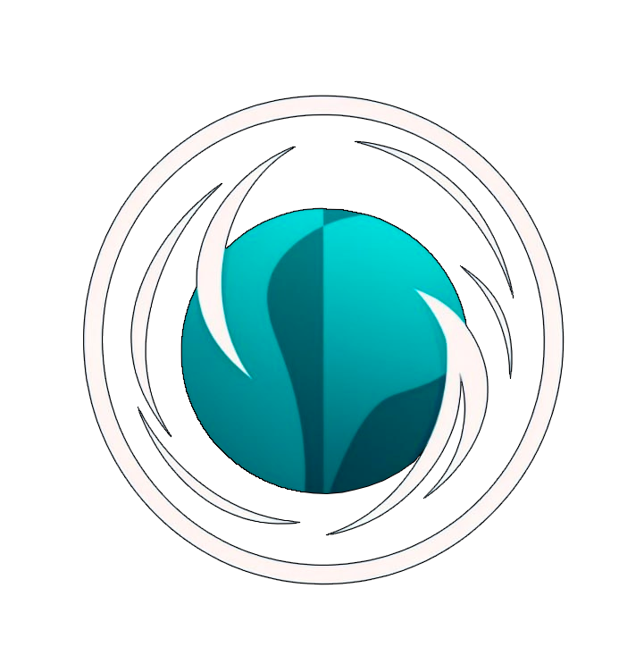
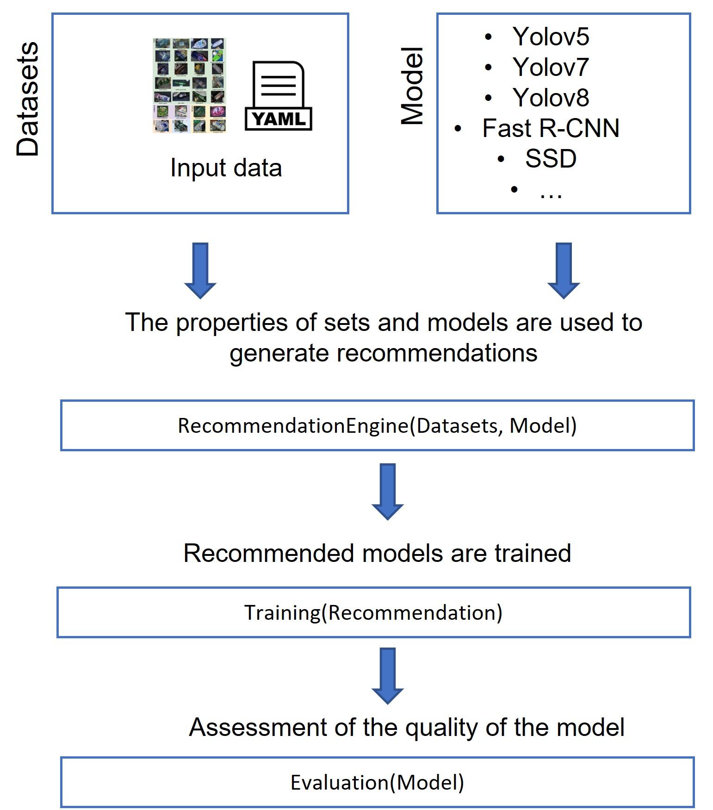
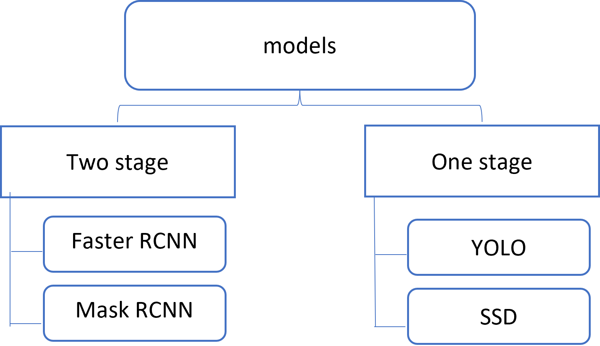
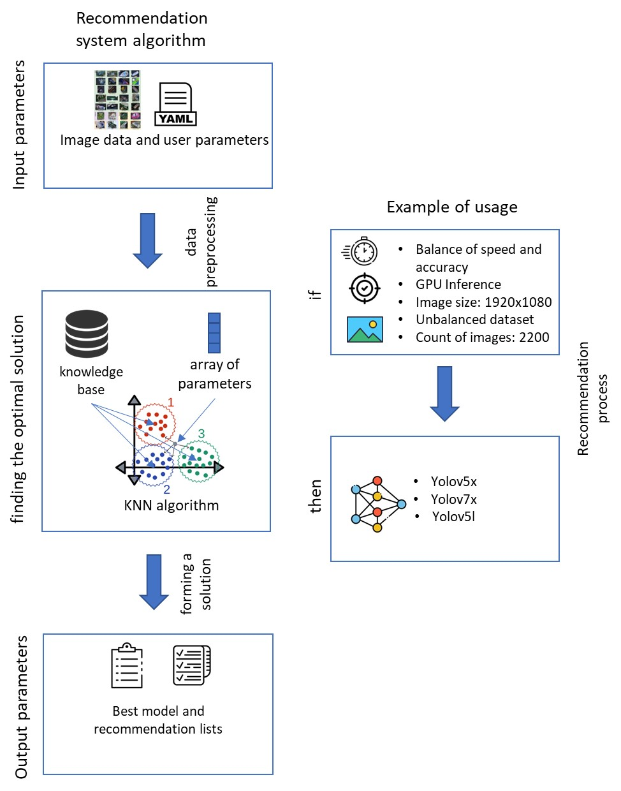
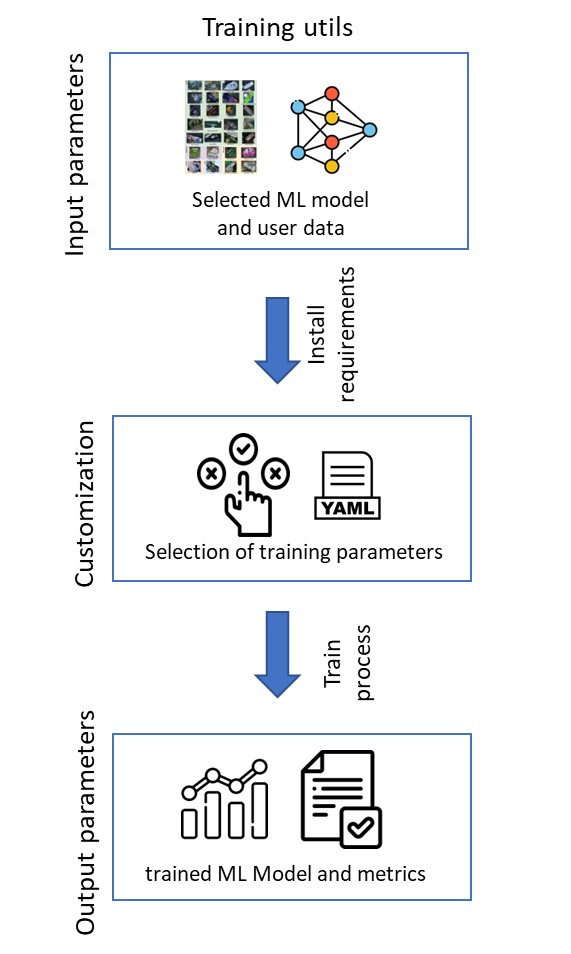

# ODRS
[](https://pypi.org/project/scikit-learn/)
<div align="center">
    <p>
        <a align="center" href="https://github.com/saaresearch/ODRS" target="_blank">
            
        </a>
    </p>
    <div style='display: block;'>
        <a href="https://itmo.ru/">
            
        </a>
        <a href="">
            
        </a>
    </div>
</div>
ODRS - it an open source recommendation system for training object detection models. Our system allows you to choose the most 
profitable existing object recognition models based on user preferences and data. In addition to choosing the 
architecture of the model, the system will help you start training and configure the environment.

The proposed recommendation system consists of several components that interact to generate recommendations for machine learning pipelines.
<div align="center">
    
</div>
External parameters (received from users and third-party resources):
* Dataset: Represents input data (video frames) and associated metadata (e.g. image size, quality, number of objects).
* Model: Framework provides an opportunity to train the most popular object recognition models (including setting up the environment 
and choosing the architecture of a specific model). Considered two-stage detectors models such as Faster R-CNN and Mask R-CNN as 
well as one-stage detectors such as SSD and YOLO (including families v5, v7, v8).
<br/>
<br>
<div align="center">
    
</div>

Internal components:

* ***RecommendationEngine***: generates recommendations based on user data and dataset characteristics.
<br/>
<br>
<div align="center">
    
</div>

The recommendation algorithm is based on production rules. The primary set of rules (knowledge base) is formed on 
the basis of the results of the analysis of scientific sources and standard data sets, but also empirical processing 
of data sets from specific industries.
The main criteria for drawing up the rules were chosen:

1. Dimension of the model 
2. The value of metrics (mAP, Recall, Accuracy) for selected datasets
3. The speed of the model on GPU and CPU
4. Supported image format and dimension


* ***Training*** - Training of models proposed by the system
<br/>
<br>
<div align="center">
    
</div>

* ***Evaluation*** – evaluation of the quality of training models


## Contents

- [Installation](#installation)
- [Dataset structure](#dataset-structure)
- [ML Recommendation system](#ml-recommendation-system)
- [Detectors Training](#detectors-training)
- [Contacts](#contacts)

## Installation

Download repository and install the necessary dependencies using the following commands:

```markdown
git clone https://github.com/saaresearch/ODRS.git
cd ODRS/
pip install -r requirements.txt 
```
## Dataset structure
To use the recommendation system or train the desired detector, put your dataset in yolo format in the ***user_datasets/yolo*** directory. The set can have the following structures:
```markdown
user_datasets
|_ _yolo
    |_ _ <folder_name_your_dataset>
        |_ _train
            |_ _images
                    |_ <name_1>.jpg
                    |_ ...
                    |_ <name_N>.jpg
            |_ _labels
                    |_ <name_1>.txt
                    |_ ...
                    |_ <name_N>.txt
        |_ _valid
            |_ _images
                    |_ <name_1>.jpg
                    |_ ...
                    |_ <name_N>.jpg
            |_ _labels
                    |_ <name_1>.txt
                    |_ ...
                    |_ <name_N>.txt
        |_ _test
            |_ _images
                    |_ <name_1>.jpg
                    |_ ...
                    |_ <name_N>.jpg
            |_ _labels
                    |_ <name_1>.txt
                    |_ ...
                    |_ <name_N>.txt

```
***or you can use the following structure, then your set will be automatically divided into samples:***

```markdown
user_datasets
|_ _yolo
    |_ _ <folder_name_your_dataset>
            |_ <name_1>.jpg
            |_ ...
            |_ <name_N>.jpg
            |_ ...
            |_ <name_1>.txt
            |_ ...
            |_ <name_N>.txt

```

Add to the root directory of the project ***.txt*** a file containing the names of all classes in your set of images.

Example **classes.txt**:
```markdown
boat
car
dock
jetski
lift
```
## ML Recommendation system
After you have placed your dataset in the folder ***user_datasets/yolo*** and created in the root directory ***.txt*** a file containing the names of all classes in your set of images. You can start working with the main functionality of the project.

1. In order to use the recommendation system, you need to configure **ml_config.yaml**. Go to the desired directory:
    ```markdown
    cd ODRS/ml_utils/config/
    ```
2. Open **ml_config.yaml** and set the necessary parameters and paths:
    ```markdown
    #dataset_path: path to data folder
    #classes_path: path to classes.txt
    #GPU: True/False
    #speed: 1 - 5 if u want max speed choose 5 or u wanna lower speed 1
    #accuracy: 1 - 10 if u want max accuracy choose 10 or u wanna lower acc 1


    GPU: true
    accuracy: 10
    classes_path: classes.txt
    dataset_path: /media/farm/ssd_1_tb_evo_sumsung/ODRS/user_datasets/yolo/plant
    speed: 1


    ```
3. Go to the script **ml_model_optimizer.py ** and start it:
    ```markdown
    cd ..
    python ml_model_optimizer.py
    ```
4. If everything worked successfully, you will see something like the following answer:
    ```markdown
    Number of images: 1016
    W: 800
    H: 600
    Gini Coefficient: 64.0
    Number of classes: 5
    Top models for training:
    1) yolov5x
    2) yolov5l
    3) yolov8x6
    ```

## Detectors Training
1. Go to the directory containing ***custom_config.yaml*** in which the training parameters are specified.
2. Setting up training parameters:
    ```markdown
    #  Name *.txt file with names classes
    CLASSES: classes.txt

     # This file generated automaticaly
    CONFIG_PATH: dataset.yaml

    # Path to data
    DATA_PATH: /media/farm/ssd_1_tb_evo_sumsung/ODRS/user_datasets/yolo/plant

    EPOCHS: 2
    IMG_SIZE: 300

    # MODEL ZOO:
    # ["yolov5l", "yolov5m", "yolov5n", "yolov5s", "yolov5x",
    #  "yolov7x", "yolov7", "yolov7-tiny", #"yolov8x6", "yolov8x",
    #  "yolov8s", "yolov8n", "yolov8m", "faster-rcnn", "ssd"]
    
    MODEL: ssd


    # For multiprocessing.
    # For CPU:
    #       GPU_COUNT: 0
    #       SELECT_GPU: cpu

    GPU_COUNT: 2
    SELECT_GPU: 0,1

    # parameters for autosplit dataset
    SPLIT_TEST_VALUE: 0.05
    SPLIT_TRAIN_VALUE: 0.6
    SPLIT_VAL_VALUE: 0.35
    ```
3. Starting training:
**NOTE**: If, for example, you specified in ***custom_config.yaml***, the path to the yolov5 model, and you want to start yolov8, training will not start.

    ```markdown
    cd ODRS/ODRS/train_utils/train_model
    python custom_train_all.py
    ```
4. After the training, you will see in the root directory ***ODRS*** a new directory ***runs***, all the results of experiments will be saved in it. For convenience, the result of each experiment is saved in a separate folder in the following form:
    ```markdown
    <year>-<mounth>-<day>_<hours>-<minutes>-<seconds>_<acrh>
    |_ _exp
        |_...
    ```

## Contacts
- [Telegram channel](https://t.me/) 
- [VK group](<https://vk.com/>)


