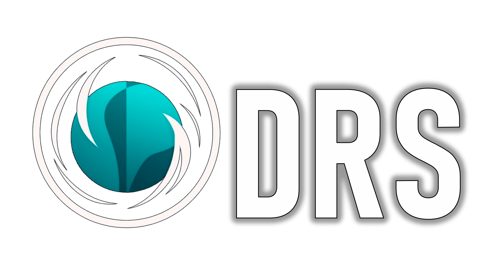

# ODRS
[](https://pypi.org/project/scikit-learn/)
[](https://odrs-test.readthedocs.io/en/latest/?badge=latest)
[](http://www.wiki.odrs.space)
<div align="center">
    <p>
        <a align="center" href="https://github.com/saaresearch/ODRS" target="_blank">
            
        </a>
    </p>
    <div style='display: block;'>
        <a href="https://itmo.ru/">
            
        </a>
        <a href="https://colab.research.google.com/drive/1mpzZFN77tKERLsPVgUEQoSa2moYkLMP-?usp=sharing">
            
        </a>
    </div>
</div>
<br></br>

**ODRS** - it an open source recommendation system for training object detection models. Our system allows you to choose the most 
profitable existing object recognition models based on user preferences and data. In addition to choosing the 
architecture of the model, the system will help you start training and configure the environment.

<div align="center">
    
</div>

The proposed recommendation system consists of several components that interact to generate recommendations for machine learning pipelines.
<div align="center">
    
</div>

The principle of operation is to find the most similar set of images in the knowledge base

<div align="center">
    
</div>

## Contents

- [Installation](#installation)
- [Dataset structure](#dataset-structure)
- [ML Recommendation system](#ml-recommendation-system)
- [Detectors Training](#detectors-training)
- [Using the API](#using-the-api)
- [Contacts](#contacts)

## Installation

Download repository and install the necessary dependencies using the following commands:

```markdown
git clone https://github.com/saaresearch/ODRS.git
cd ODRS/
pip install -r requirements.txt 
```
## Dataset structure
To use the recommendation system or train the desired detector, put your dataset in yolo format in the ***user_datasets/*** directory. The set can have the following structures:
```markdown
user_datasets
|_ _ <folder_name_your_dataset>
    |_ _train
        |_ _images
                |_ <name_1>.jpg
                |_ ...
                |_ <name_N>.jpg
        |_ _labels
                |_ <name_1>.txt
                |_ ...
                |_ <name_N>.txt
    |_ _valid
        |_ _images
                |_ <name_1>.jpg
                |_ ...
                |_ <name_N>.jpg
        |_ _labels
                |_ <name_1>.txt
                |_ ...
                |_ <name_N>.txt
    |_ _test
        |_ _images
                |_ <name_1>.jpg
                |_ ...
                |_ <name_N>.jpg
        |_ _labels
                |_ <name_1>.txt
                |_ ...
                |_ <name_N>.txt

```
***or you can use the following structure, then your set will be automatically divided into samples:***

```markdown
user_datasets
|_ _ <folder_name_your_dataset>
        |_ <name_1>.jpg
        |_ ...
        |_ <name_N>.jpg
        |_ ...
        |_ <name_1>.txt
        |_ ...
        |_ <name_N>.txt

```

Add to the root directory of the project ***.txt*** a file containing the names of all classes in your set of images.

Example **classes.txt**:
```markdown
boat
car
dock
jetski
lift
```
## ML Recommendation system
After you have placed your dataset in the folder ***user_datasets/*** and created in the root directory ***.txt*** a file containing the names of all classes in your set of images. You can start working with the main functionality of the project.

1. In order to use the recommendation system, you need to configure **ml_config.yaml**. Go to the desired directory:
    ```markdown
    cd src/ML/config/
    ```
2. Open **ml_config.yaml** and set the necessary parameters and paths:
    ```markdown
    #dataset_path: path to data folder or name dataset folder in user_dataset
    #classes_path: path to classes.txt or name classes.txt in root directory
    #GPU: True/False - "Inference mode"
    #speed: True/False - "Search for models with a focus on speed"
    #accuracy: True/False - "Search for models with a focus on accuracy"
    #balance: True/False - "Search for models with a focus on the balance between speed and accuracy"


    classes_path: classes.txt
    dataset_path: /home/runner/work/ODRS/ODRS/user_datasets/WaRP/Warp-D
    GPU: False
    accuracy: False
    speed: False
    balance: True
    ```
3. Go to the script **run_recommender.py** and start it:
    ```markdown
    cd ..
    python run_recommender.py
    ```
4. If everything worked successfully, you will see something like the following answer:
    ```markdown

    Top models for training:
    1) yolov7
    2) yolov8x6
    3) yolov7x
    ```

## Detectors Training
1. Go to the directory containing ***train_config.yaml*** in which the training parameters are specified.
    ```markdown
    cd ODRS/src/DL/config
    ```
2. Setting up training parameters:
    ```markdown
    #  Name *.txt file with names classes
    CLASSES: classes.txt

     # This file generated automaticaly
    CONFIG_PATH: dataset.yaml

    # Path to data
    DATA_PATH: /media/farm/ssd_1_tb_evo_sumsung/ODRS/user_datasets/yolo/plant

    EPOCHS: 2
    IMG_SIZE: 300
    BATCH_SIZE: 16

    # MODEL ZOO:
    # ["yolov5l", "yolov5m", "yolov5n", "yolov5s", "yolov5x",
    #  "yolov7x", "yolov7", "yolov7-tiny", #"yolov8x6", "yolov8x",
    #  "yolov8s", "yolov8n", "yolov8m", "faster-rcnn", "ssd"]

    # **NOTE**: For successful training of the ssd model, 
    # the size of your images should not exceed 512x512
    

    # You can also use this format if need to train few models
    # MODEL: ['yolov5s', 'yolov5l'] this can also be applied to parameters EPOCHS, BATCH_SIZE, IMG_SIZE
    MODEL: ssd

    # For multiprocessing.
    # For CPU:
    #       GPU_COUNT: 0
    #       SELECT_GPU: cpu

    GPU_COUNT: 2
    SELECT_GPU: 0,1

    # parameters for autosplit dataset
    SPLIT_TRAIN_VALUE: 0.6
    SPLIT_VAL_VALUE: 0.35
    ```
3. Starting training:
**NOTE**: If, for example, you specified in ***train_config.yaml***, the path to the yolov5 model, and you want to start yolov8, training will not start.

    ```markdown
    cd ..
    python train_detectors.py
    ```
4. After the training, you will see in the root directory ***ODRS*** a new directory ***runs***, all the results of experiments will be saved in it. For convenience, the result of each experiment is saved in a separate folder in the following form:
    ```markdown
    <year>-<mounth>-<day>_<hours>-<minutes>-<seconds>_<model_name>
    |_ _exp
        |_...
    ```

## Using the API
To use the project in your code, you can use the built-in Api. You can see full examples of using the API here: [Example API](https://github.com/saaresearch/ODRS/blob/master/examples/api_example.ipynb).
1. Initializing a task:
```python
from ODRS.src.api.ODRS import ODRS
#init object with parameters
odrs = ODRS(job="object_detection", data_path='full_data_path', classes="classes.txt", img_size = 300,
              batch_size = 20, epochs = 1, model = 'yolov8n', split_train_value = 0.85, split_val_value = 0.1,
              gpu_count = 1, select_gpu = 0)
```
2. Starting training:
```python
odrs.fit()
```
3. Getting results:
```python
!yolo val detect data=path_to_data device=0 model=ODRS/runs/path_to_experiment/best.pt
```
4. Example results:
<div align="center">
    
    
</div>


This project is actively used in testing new models and datasets in Insystem for classification and detection of garbage.
<div align="center">
    
</div>

## Contact us
<div align="center">
    <a href="https://t.me/dedinside4ever">
        
    </a>
</div>


