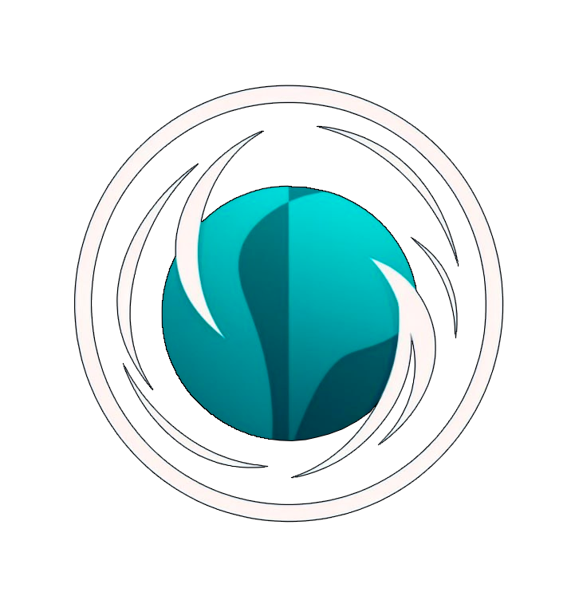

Introduction to Framework
=========================

.. toctree::
    :maxdepth: 1
    :caption: Content:

    installation
    quickstart
    architecture
    license

ODRS - it an open source recommendation system for training object detection models. Our system allows you to choose the most profitable existing object recognition models based on user preferences and data. In addition to choosing the architecture of the model, the system will help you start training and configure the environment.
The proposed recommendation system consists of several components that interact to generate recommendations for machine learning pipelines.

